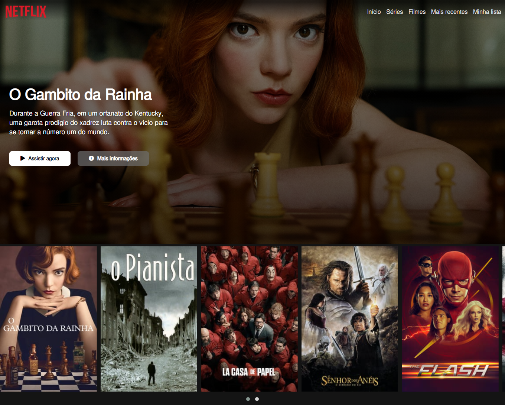

## Recriação página inicial do Netflix
#### Recriação de website com base na plataforma de streaming Netflix

Este é a recriação da página inicial da Netflix, contendo apenas a capa da série principal e o carrosel com filmes em destaque, o resultado do projeto ficou bem satisfatório e semelhante à plataforma.
As tecnologias utilizadas foram:
- HTML
- CSS
- jQuery
- Owl Carousel: plugin jQuery para o carrosel de séries e filmes

A escolha da série foi "O Gambito da Rainha", que reforça o interesse de várias pessoas pelo xadrez, inclusive o meu, que voltei a jogar devido a série. O resultado pode ser visualizado [nesse link](https://recriacaonetflix.netlify.app/).
